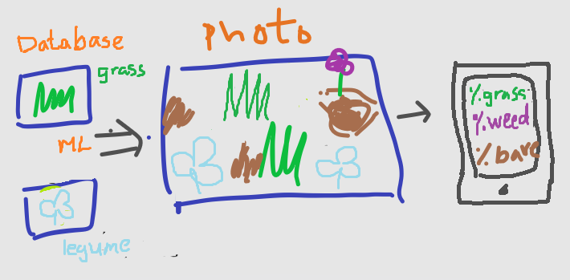
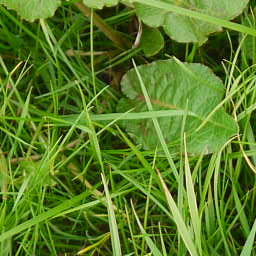
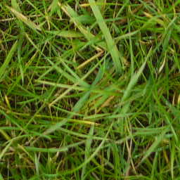
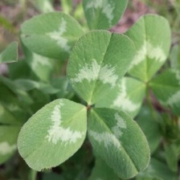
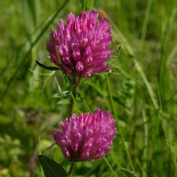
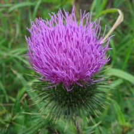

Summary: For my final project at Metis, I set out to do the passion project I had in mind from the start. It is a plant identification app that will tell you your pasture composition. I took an iterative approach to this project, starting from a simple binary classification. After expanding to four classes and trying two different image sources, I built an Flask app that will segment a photo of pasture into sub images and count up the class of each sub image to calculate the pasture composition. I have linked a video of my final presentation

Table of Contents

1. [Background](#background)
2. [Binary classification](#binary)
3. [Imagenet](#imagenet)
4. [Pl@ntNet](#plantnet)
5. [Metis Presentation](#presentation)

## Background 

Before attending Metis, I was a livestock apprentice on a small farm. To better plan for the next growing season, I used Excel to work with the little data we had to compare potential decisions. That's when I started to learn more about and appreciate the field of data science. So I started thinking about applications.

One of the things I struggled with on the farm was evaluating pasture quality, or the amount of food available in grassland managed for grazing animals like cattle. Pasture quality is important in a number of ways. First, environmentally, high quality pasture means more carbon sequestration and resistance to drought conditions. Second, economically, high quality pasture allows for healthier animals, faster weight gain, and a longer grazing season.

Experienced farmers get a rough feel for how well their pastures are doing just by looking at the grass and the animals. However, to actually quantify that, what many do is look at small sections sampled randomly from a field and estimate the height and density of the grass there. This is all based on approximations and I, for one, had a tough time with both identifying plants and just getting a number for the medley of plants in each section, where useful plants were intertwined with weeds and bare ground.

Can we replace this approximate process with something more efficient and accurate? Yes! With the advent of smartphones and computer vision, we should be able to take a photo and have an application return the exact composition of our randomly sampled section of the pasture. This will make it easy for newcomers to learn how to assess their pasture as well as for veterans to record their observations and see the impact of their management strategies.  

Above is a drawing of Pasture Snap, the idea I pitched for my passion project during my Metis application process. I wanted to learn what felt like an almost magical process of image recognition and solve a real problem people face in the field.

Machine learning has a lot of potential applications agriculture, but the big problem is getting someone to actually gather the data. Most farmers won't have the time to take soil samples or record whatever observation you need with all the things they have to work on. Unless you make it really easy. Like taking a photo with your phone.

## Binary Classification

Data science is an iterative process, so I took the same approach to Pasture Snap. I started with a simple binary classification problem to become familiar with convolutional neural networks (CNNs) and Keras, a wrapper for Tensorflow and deep learning architecture. Conveniently, I found a [collection of broad leaved dock images](https://www.kaggle.com/gavinarmstrong/open-sprayer-images/home) on Kaggle meant for training an open sourced weed sprayer land drone. This was a perfect place to start because the images are very relevant to my problem and Kaggle data sets are straightforward to work with.

   
A sample of the type of images I was working with. Dock(L) and grass(R).

There were about 6000 images in the training set and 600 in the test set. THe classes were imbalanced, roughly 5:1 ratio of the negative class to the positive class. With relatively few images, it is helpful to utilize a pretrained convolutional neural network that has already learned generic patterns such as edges as a base and only train the top layers to recognize your specific classes. 

The validation accuracy reached 90% using only a single dense layer on top of the base VGG16 model. Augmentating the images using Keras's built in ImageDataGenerator and fine tuning by unfreezing and retraining some of the parameters of the top convolutional layers of the improved the metric marginally to 92%. Because of the class imbalance, accuracy is not a good metric and a closer look at the results reveal that the recall on the is-dock class was only around 65%. 

<!-- The images were already square, so I only had to scale it down slightly to 224x224 for VGG16. -->

I could have refined this model further but the broad leaf dock is a very narrow problem and I wanted to move on to my real question. 

## ImageNet

To get a useful model, I needed to expand beyond Kaggle and broad leaf docks. The first place I looked was ImageNet, which is the original image database that VGG16 and other pretrained networks benchmark on. The best thing about this is that images are labeled by people, so you are not just relying on search terms to get your labels. Furthermore, they provide a text file with a list of urls, so it was straightforward for me to use the Request python package and get those images. With that said, Im@genet did not come without problems, such as many dead links, irregular image sizes, and unrepresentative images. The first two problems I overcame by building in exception catching blocks and adding in resizing that preserves the original aspect ratio, respectively. 

| Clover Leaf                |  Clover Flower      | Thistle Flower|
|------------------------|-------------------------|-----|
||   ||
Leafy (L) versus flowering(M) state of a clover, a forb. And a bull thistle flower(R), a weed.

The last problem was the trickiest. As I trained a new CNN classifier on the ImageNet data, using many of the same steps as the simple binary problem I practiced with earlier but expanding to a multiclass problem, I noticed that clovers were often being misclassified as a weed, rather than the forb that it is. Part of the issue is that the only difference between a forb and a weed is whether you find the plant desirable or not, so they are likely to share physiological features. The even bigger issue is that the flowers are the most distinguishing, and often most aesthetic, feature of a plant, and they are completely dominant in the ImageNet photos. However, a thriving pasture should have plants in their vegetative, or leafy, state for optimal nutritional value, well before they develop any flowers. Therefore, if I were to give it pasture photos, the model will not have any success classifying plants in their leafy states when all the model has seen are flowers! 

## Pl@ntNet

To address the lack of leafy plant images, I scraped a new set of images from Pl@ntNet, a crowd sourced plant image database with closeups on the various plant organs beyond just flowers. Scraping these images presented a new challenge because the website uses JavaScript to load its image gallery, so a simple request would not retrieve anything. I took this opportunity to learn to use a Selenium WebDriver to load the image gallery and get the urls of the individual images. Even with the Pl@ntNet images, there was a severe lack of good grass photos because they only focused on the single blade. Fortunately, there were plenty of pasture grass images from the binary classification data. Putting these sources together, I had over 20000 training images, albeit with an uneven distribution. 

## Metis Presentation

For a change of pace, here is my presentation describing my workflow and results for the Pl@ntNet iteration of Pasture Snap. 

<iframe src="https://drive.google.com/file/d/1RjIKokgIVh8i1XVU_6jzZp9W6Gz4ced_/preview" width="640" height="480"></iframe>

A couple of points I want to add for the video:
1. To do the segmentation, I used numpy slicing to crop the appropriate arrays of pixels from the image. 
2. For the web app output, I used the D3.js package to overlay a grid of squares over the original image to show what the actual subimages being classified were.

The next step for Pasture Snap is to come up with a user interface where I, or an experienced farmer or botanist, can label the subimages generated by the segmentation of pasture photos more quickly and easily and feed them to the model for further training. 