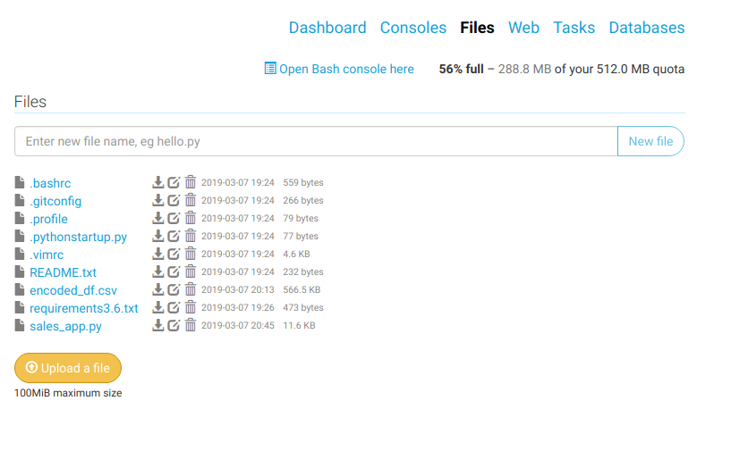
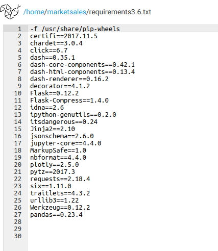
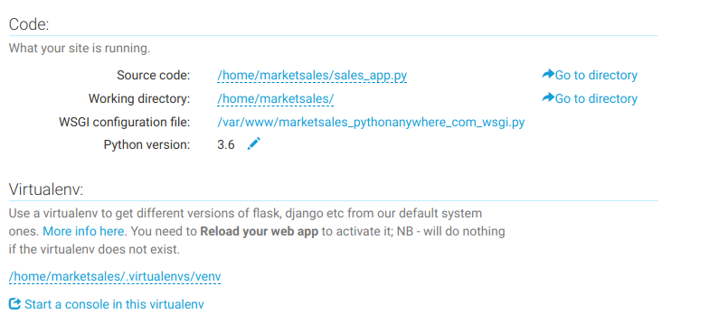
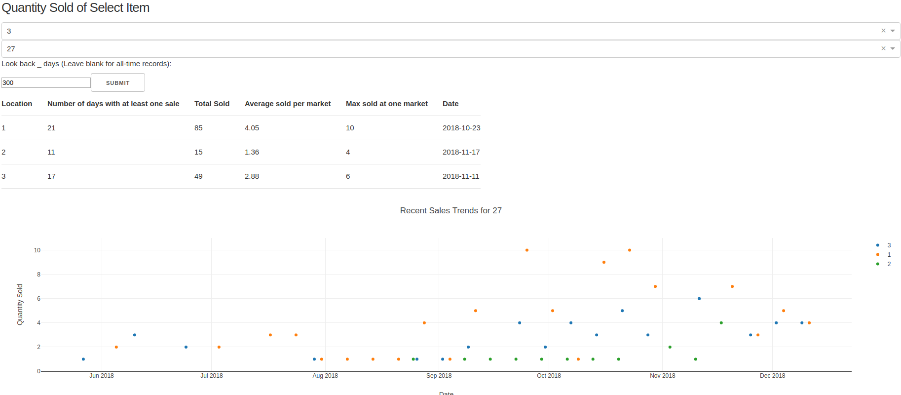

Credits: Photo by Mohammad Saifullah on Unsplash


# Visualizing Market Sales with Dash

Here's the [link to the app](https://marketsales.pythonanywhere.com/). Please feel free to check it out! 

If you would like to know how I got there, read on.

# Background

One project that I have been working on for a while is making sense of the data for the small farm where I used to work. As fascinating as [Pasture Snap and convolutional neural networks](https://douglas-l.github.io/grass_analytics/journal/Pasture-Snap.html) are, the truth is that wrangling sales and inventory data are more valuable to the farm at this moment in time. This project is still ongoing but to help the farm engage with its data, one step I took was deploying an interactive web app through [PythonAnywhere](http://www.pythonanywhere.com/).

PythonAnywhere allows you to do various things by hosting your Python code, but its best feature is serving up your web application. With a few simple steps, you can put your app on the web for free! At the free tier, you do get limited compute but it is more than enough for a simple app like this one.

# Setting up

## Upload files

After you sign up, navigate to the Files tab and upload the files you need. 



For me, I only had to upload three files: my data as a csv, my Dash app script, and a requirements.txt file. 

## Create virtual environment

A virtual environment is a tool to keep dependencies for different projects separate. This is very useful for keeping your app in working order.

To create one, open up a bash console in PythonAnywhere and enter two commands:
```
# make the venv
mkvirtualenv venv_name --python=3.6

# install dependencies
pip install -r requirements.txt
```

"mkvirtualenv" is a command from the [virtualenvwrapper extension](https://virtualenvwrapper.readthedocs.io/en/latest/), which helps make virtual environment (venv) creation foolproof. Notably, you are automatically placed in the venv with this command. This also gives you access to the environment's own pip for installing packages.
The -r option refers to requirements, which lets you install everything in one command because it tells pip it will be looking up the dependencies based on a text file.
Here's what the file would look like. 



If all goes well, you do not get any errors and now you're ready to set up your web app! 

I did run into space issues trying to install the latest version of Plotly. I wonder if they added a lot in version 3.0+ but everything I need is available in 2.5 so I simply used that instead. 

## Configure web app

Head on over to the web tab and go through the prompt, selecting manual configuration if using Dash or the relevant option otherwise. 
Scroll down and you'll see a few places where you need to specify file paths. 



As you can see above, "Source code" takes the script for your app. Slightly below that you can tell the web app to run in the virtual environment you set up in the previous section. If you used mkvirtualenv, it will be stored in /home/{username}/.virtualenvs/{venv_name}. Substitute in your own folder names as needed within the curly brackets. 

Next, we'll edit the WSGI (Web Server Gateway Interface) configuration file. If you're using Django, Flask or others, follow the instructions in the comments of this file. For a Dash app like mine, simply replace the whole file with the following: 

```
import sys

# add your project directory to the sys.path
project_home = u'/home/{username}/'
bin = u'/bin'
if project_home not in sys.path:
    sys.path = [project_home, bin] + sys.path

# need to pass the flask app as "application" for WSGI to work
# for a dash app, that is at app.server
# see https://plot.ly/dash/deployment

from sales_app import app  # change sales_app to your script's name
application = app.server
```

With that done, scroll all the way back up and hit Reload. Your app should now be launched! 

# Wrapping Up

Here's a view of the app in action. I haven't incorporated any CSS to improve its appearance but it is interactive and on the web! Now the users from the farm can simply access an [URL](https://marketsales.pythonanywhere.com/) and play with the data as they need to to get information like the historical sales trends for a select item.



As you can tell, I tried to anonymize the sales data, so the options look a bt cryptic. However, the code for the app is up on [Github](https://github.com/Douglas-L/market_sales) and if you have similar types of sales data you want to visualize, you can use this as a template if you like! This project is also a work in progress so as I improve the app for the farm, I'll bring those changes over here as well. 

## Links

For more information on the web hosting, check out PythonAnywhere's [help pages](https://help.pythonanywhere.com/pages/). The staff there also seems to be active and helpful on their forums. 

Dash has a very intuitive system and you can learn the syntax quickly with the great tutorial on their [website](https://dash.plot.ly/). 

Have any questions or notice any mistakes? Please feel free to reach out through email or elsewhere.